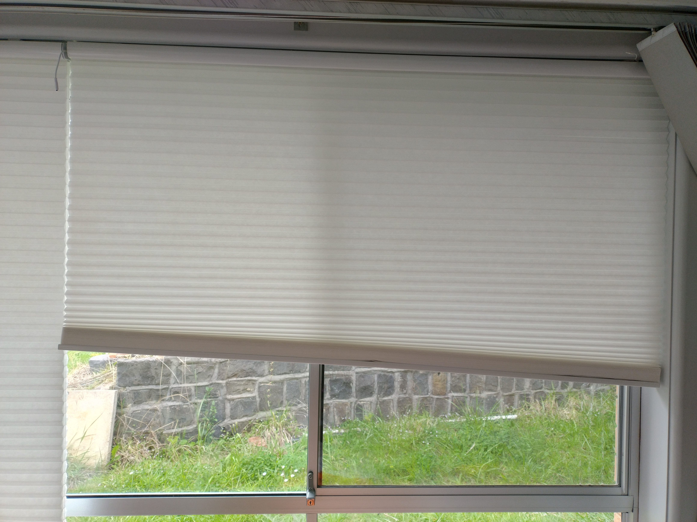
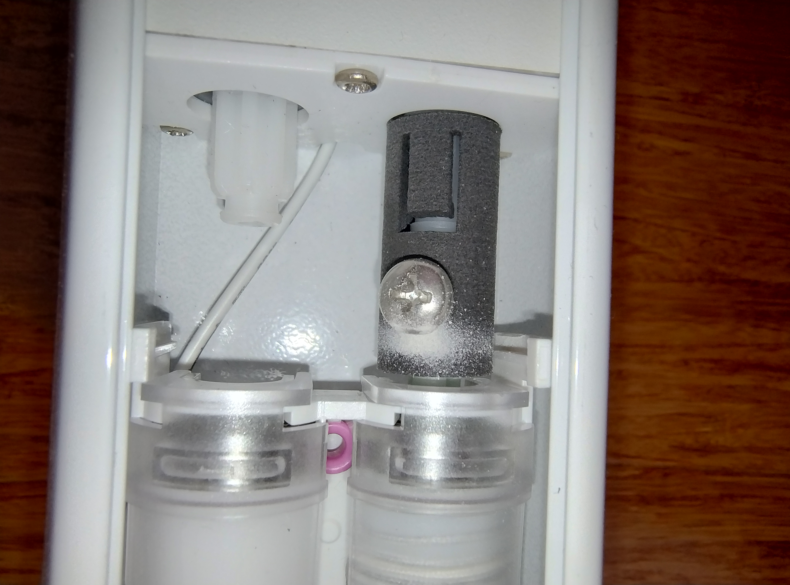
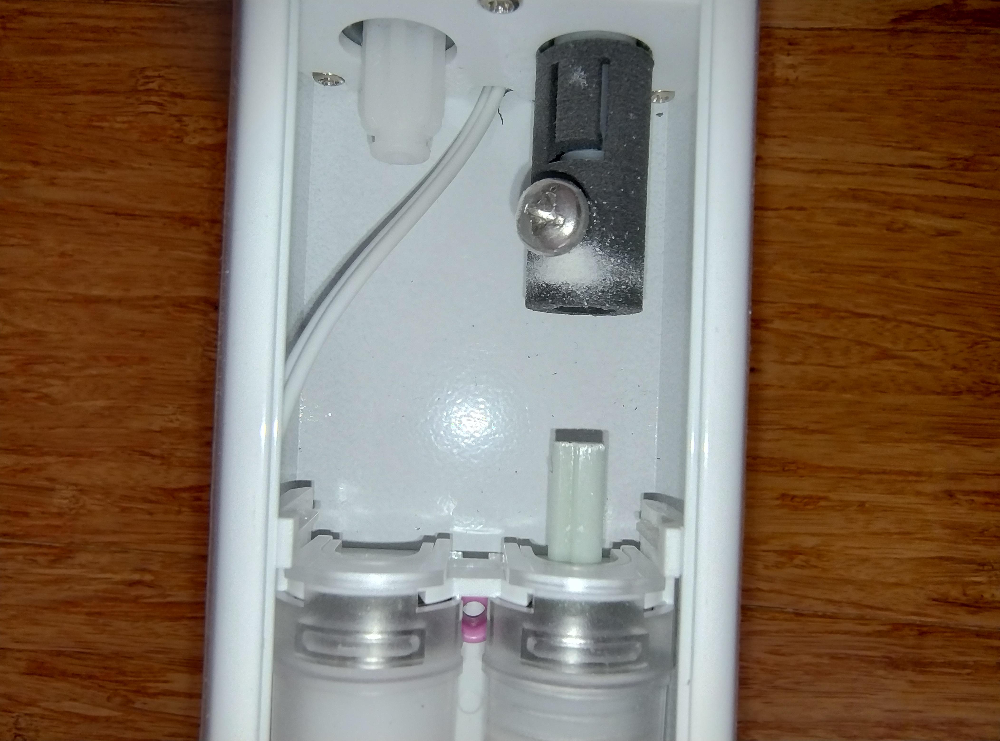
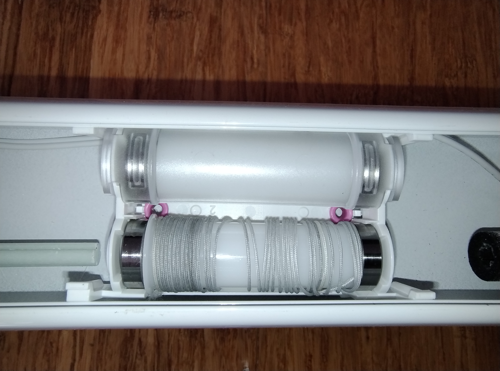
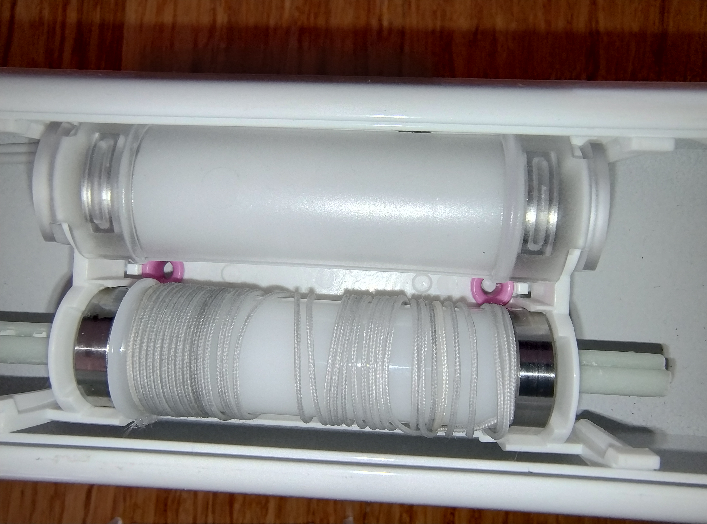
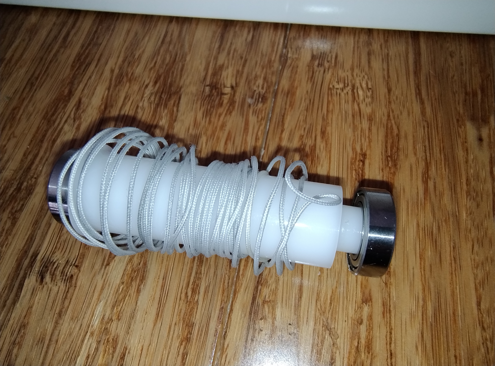
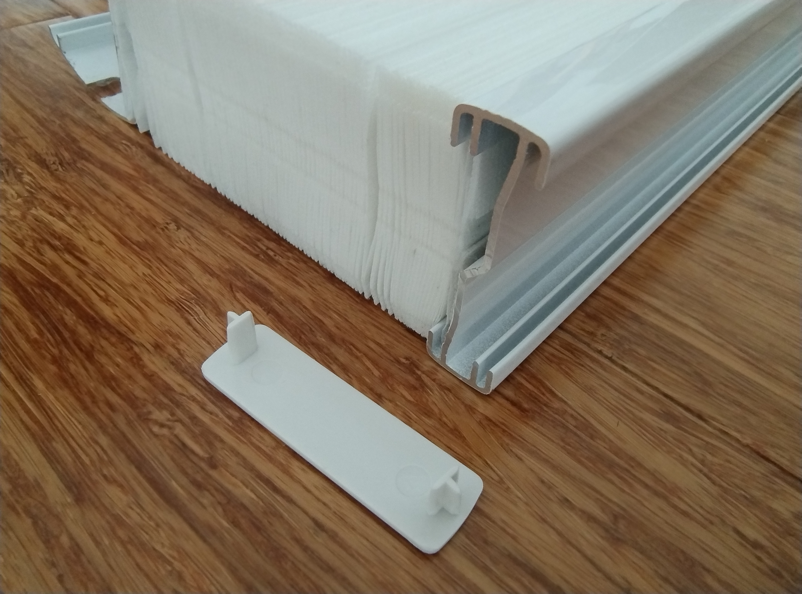
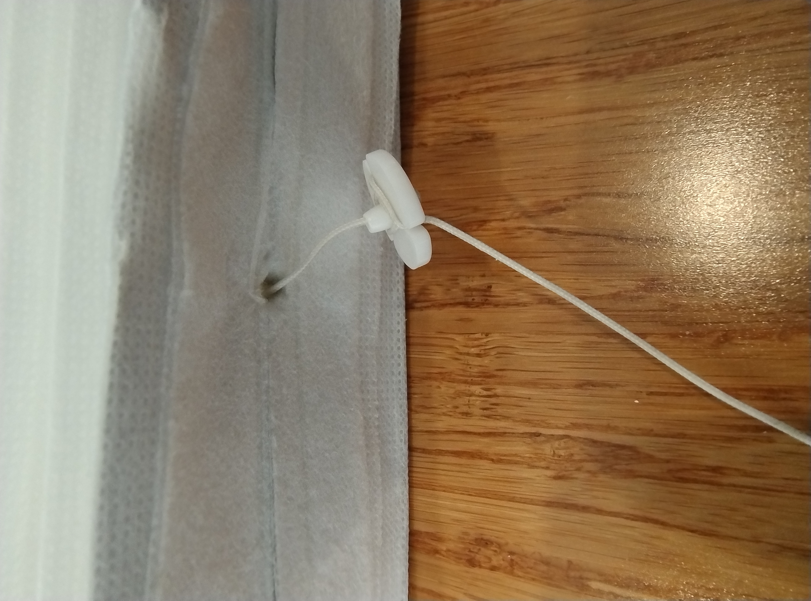
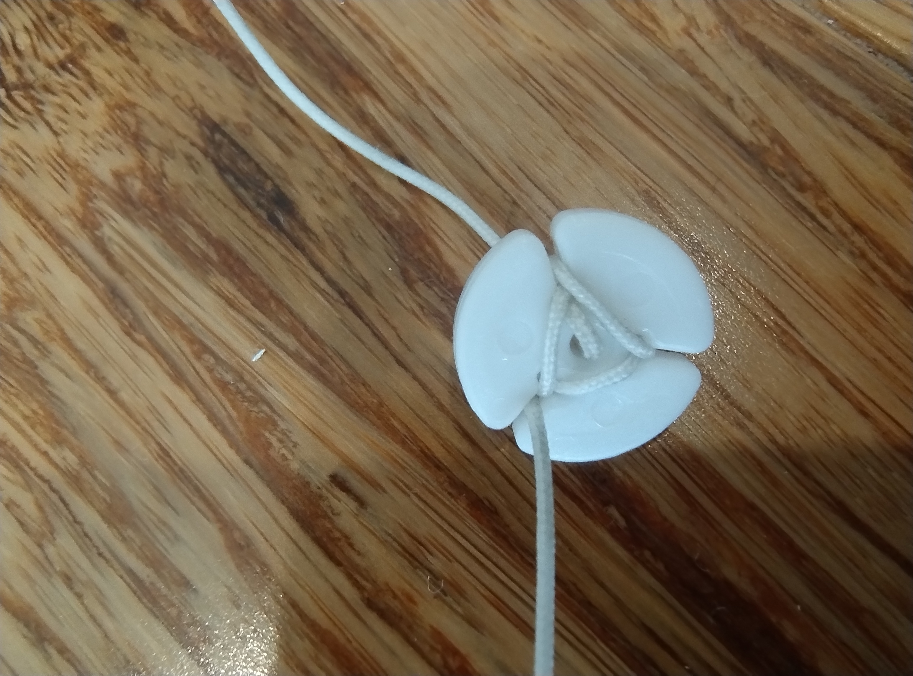
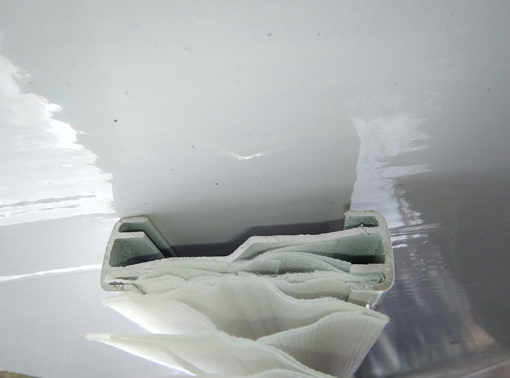

Blinds typically have multiple strings that can break through improper handling, or wear and tear. The main symptom of a broken string is typically the blind sagging at one end.

*(Above) Example blind with broken (rightmost) string*

Steps to replacing a broken string involve accessing the roller, removing the broken string and replacing the string.

Accessing the roller with the broken string

1. Raise the blind to the top most point
2. Remove the blind from its mount
3. Use the remote to rotate the motor so the screw that attaches the motor to the rotation shaft is accessible 
4. Unscrew the screw attaching the shaft to the motor
5. Separate the motor from the rotation shaft (this may require disconnecting the battery from the motor or increasing the slack in the power cable)

6. Locate the broken cord
7. Slide the rotation shaft out of the roller with the broken cord (this may require removal of the battery or motor) 

Removing the broken string (top section)

1. Detach the roller cover by carefully detaching the four latches (use a pry tool and/or dental pick) 
2. Note the string orientation and path. The roller guide is closest to the string entry/exit hole
2. Pry the roller from its mount
3. Remove the roller and broken string
4. Detach the bearing at the end where the string is attached 
5. Remove the string from the roller
6. Pull the broken string out

Remove the broken string (bottom half)

1. Remove the bottom rail end stops 
2. Slide the blind out of the bottom rail
3. Pull the string end stop and bottom half of the broken string out 
4. Detach the string from its endstop

Replace the broken string

1. Using a needle, thread the replacement string up from the bottom of the blind up into the head rail
2. Knot the end of the string and attach it to the end of the roller through the string guide
3. Replace the bearing
4. Reseat the roller ensuring the string is slightly taught
5. Replace roller cover

Measure approximate string length

1. Remove the rotation shaft
2. Pull the blind from the head rail so that it reaches its lowest point
3. Pull the new string so that it is slightly taught
4. Rotate rollers so they have approximately the same amount of string wound around them
5. Cut new string with about 10 to 15 cms extra
6. Wind new string around the string end stop 

Replace head rail mechanism

1. With the motor detached from the rotation shaft, rotate motor to the blind's lowest point
2. Rotate motor so the screw position is accessible
3. Slide rotation shaft back through rollers
4. Attach rotation shaft to the motor with the screw (rotate the shaft so the screw meets the same location)

Adjust new string to its proper length

1. Raise the blind to its highest point (some tension is required on the strings to ensure proper winding. This can be done by raising the head rail so the blind's weight pulls on the string)
2. Pull new string taught and reposition string end stop
3. Lower blind to its lowest point
4. Check bottom rail is horizontal. Re-adjust string end stop if necessary.

Reattach bottom rail

1. Feed blind through narrow guides in the bottom rail (the blind should feed freely with minimal resistance) 
2. Reattach rail end stops
